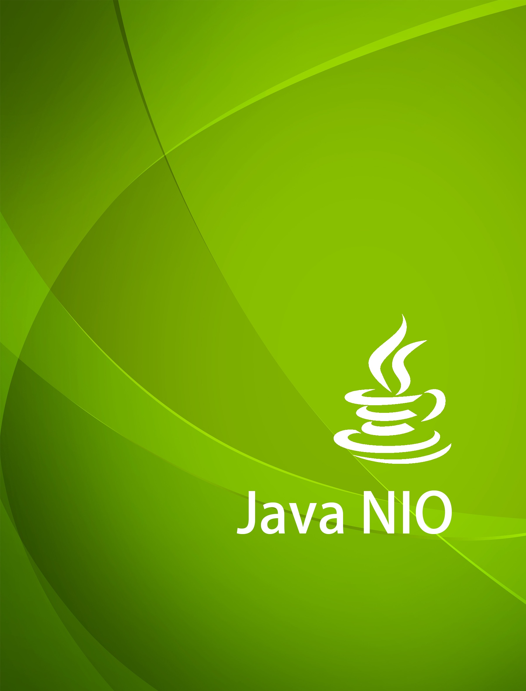

# Java NIO 简明教程
在查阅NIO相关资料时, 发现一份很不错的资源，一位老外写的nio系列教程：
> [http://tutorials.jenkov.com/java-nio/index.html](http://tutorials.jenkov.com/java-nio/index.html)

通读的过程中发现作者的文笔非常好，把技术概念讲的透彻，浅显易懂。  
教程质量整体非常不错🎉，故而将其翻译为中文版😎。  

翻译系列暂定名为《Java NIO 简明教程》。

版本 | 修订时间
------------ | -------------
v1.0 | 2016/05/11

---
## 联系

* 作者：<info@jenkov.com>
* 译者：<me@avenwu.net> @[小文字](https://github.com/avenwu)